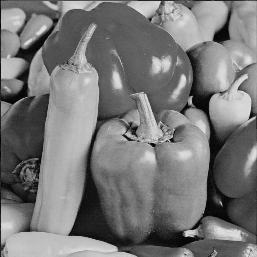

<h1 align="center" id="title">Processamento de Imagem usando C</h1>

<p id="description">O projeto consiste na codificação e decodificação de uma imagem usando o algoritmo de quadtree.</p>

|ORIGINAL|COMPRIMIDA|
|--|--|
| | 

- BISTREAM GERADO COM LIMIAR DE 50 DE UMA IMAGEM 512X512 COM TAMANHO DE 257Kb FOI DE 69Kb

<h2>🛠️ Passo a Passo para execução</h2>
<h3>ENCODER: </h3>
<p>O encoder vai ser encarregado de fazer a compressão da imagem e gerar um arquivo binário denomidado de bitstream.</p>
<li>
    Execute: <br>
</li>

```
    cd encoder

    make ou mingw-32

    ./bin/encoder ../images/input/<nome_da_imagem>.pgm ../bitstream/<nome_do_bitstream>.dat <limiar_threshold>
```

<h3>DECODER: </h3>
<p>O decoder vai ser encarregado de fazer a decodificação do bitstream gerado pelo encoder e nos trazer uma imagem comprimida. </p>
<li>
    Execute: <br>
</li>

```
    cd decoder

    make ou mingw-32

    ./bin/decoder ../bitstream/<nome_do_bitstream>.dat  ../images/output/<nome_da_imagem_de_saida>.pgm 
```